# AI Consulting Assistant Platform - 워크플로우 블록 다이어그램
> Update: March 9, 2026 / Designer: Brian Lee / 100K AX Expert Team

**문서 버전**: 1.1  
**작성일**: 2025년 12월 11일  
**Update Date**: Dec. 16, 2025
**Editor**: Brian Lee / WDLAB AI/ML/AX Group

---

## 목차

1. [전체 시스템 아키텍처](#1-전체-시스템-아키텍처)
2. [메인 컨설팅 워크플로우](#2-메인-컨설팅-워크플로우)
3. [5단계 컨설팅 프레임워크 상세](#3-5단계-컨설팅-프레임워크-상세)
4. [에이전트 오케스트레이션 플로우](#4-에이전트-오케스트레이션-플로우)
5. [데이터 처리 및 분석 플로우](#5-데이터-처리-및-분석-플로우)
6. [시나리오 분석 워크플로우](#6-시나리오-분석-워크플로우)
7. [인간-AI 협업 워크플로우](#7-인간-ai-협업-워크플로우)
8. [보고서 생성 플로우](#8-보고서-생성-플로우)
9. [API 요청 흐름](#9-api-요청-흐름)

---

## 1. 전체 시스템 아키텍처

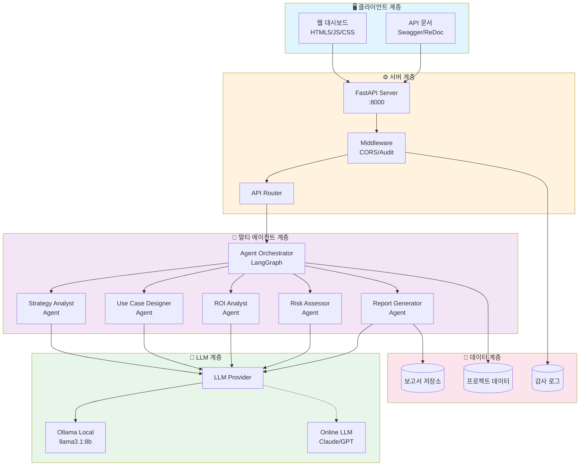

---

## 2. 메인 컨설팅 워크플로우

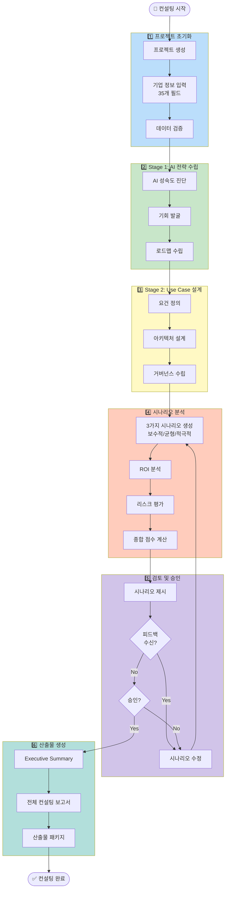

---

## 3. 5단계 컨설팅 프레임워크 상세

```mermaid
flowchart LR
    subgraph S1["🎯 Stage 1<br/>AI 비전 및 전략 수립"]
        S1_1[AI 성숙도 진단]
        S1_2[기회 발굴]
        S1_3[전략/로드맵 수립]
        S1_OUT[산출물:<br/>• AI 비전 선언문<br/>• 성숙도 진단서<br/>• Use Case 후보<br/>• 전략 로드맵]
    end
    
    subgraph S2["📐 Stage 2<br/>Use Case 및 설계 정의"]
        S2_1[상세 요건 정의]
        S2_2[기술 아키텍처 설계]
        S2_3[거버넌스/윤리 수립]
        S2_OUT[산출물:<br/>• 요건 정의서<br/>• 아키텍처 설계서<br/>• 거버넌스 프레임워크]
    end
    
    subgraph S3["🔧 Stage 3<br/>플랫폼 및 솔루션 구축"]
        S3_1[PoC 수행]
        S3_2[AI 플랫폼 구축]
        S3_3[솔루션 개발/통합]
        S3_OUT[산출물:<br/>• PoC 결과 보고서<br/>• 플랫폼 구축 완료<br/>• 통합 솔루션]
    end
    
    subgraph S4["🚀 Stage 4<br/>파일럿 및 확산"]
        S4_1[파일럿 운영]
        S4_2[변화 관리]
        S4_3[전사 확산]
        S4_OUT[산출물:<br/>• 파일럿 결과<br/>• 변화 관리 보고서<br/>• 확산 계획서]
    end
    
    subgraph S5["⚡ Stage 5<br/>운영/모니터링/개선"]
        S5_1[운영 및 모니터링]
        S5_2[피드백 루프]
        S5_3[지속적 개선]
        S5_OUT[산출물:<br/>• 운영 대시보드<br/>• 성과 보고서<br/>• 개선 로드맵]
    end
    
    S1_1 --> S1_2 --> S1_3 --> S1_OUT
    S2_1 --> S2_2 --> S2_3 --> S2_OUT
    S3_1 --> S3_2 --> S3_3 --> S3_OUT
    S4_1 --> S4_2 --> S4_3 --> S4_OUT
    S5_1 --> S5_2 --> S5_3 --> S5_OUT
    
    S1_OUT ==> S2_1
    S2_OUT ==> S3_1
    S3_OUT ==> S4_1
    S4_OUT ==> S5_1

    style S1 fill:#e3f2fd
    style S2 fill:#f3e5f5
    style S3 fill:#fff8e1
    style S4 fill:#e8f5e9
    style S5 fill:#fce4ec
```

---

## 4. 에이전트 오케스트레이션 플로우

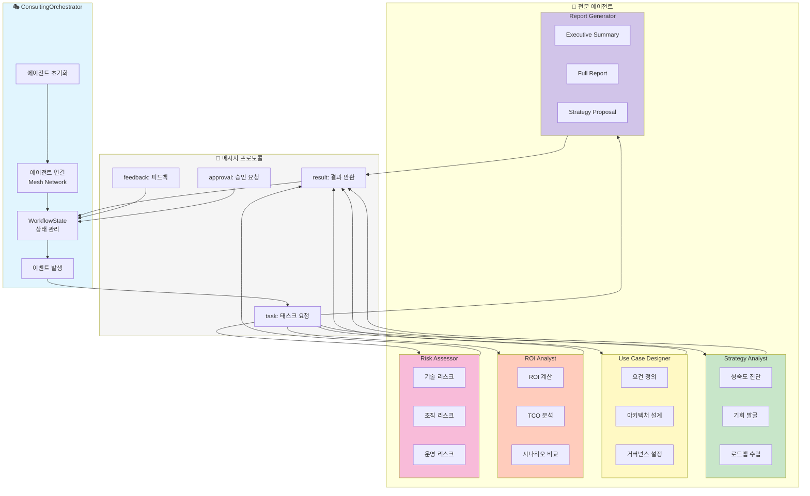

---

## 5. 데이터 처리 및 분석 플로우

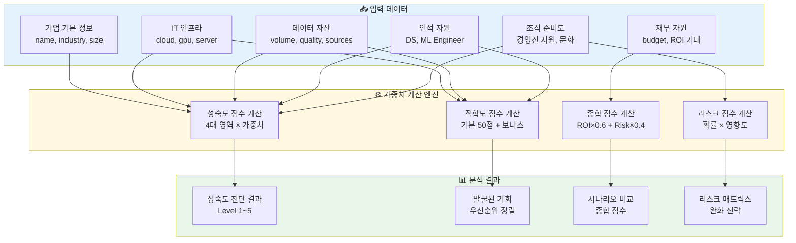

### 가중치 계산 상세

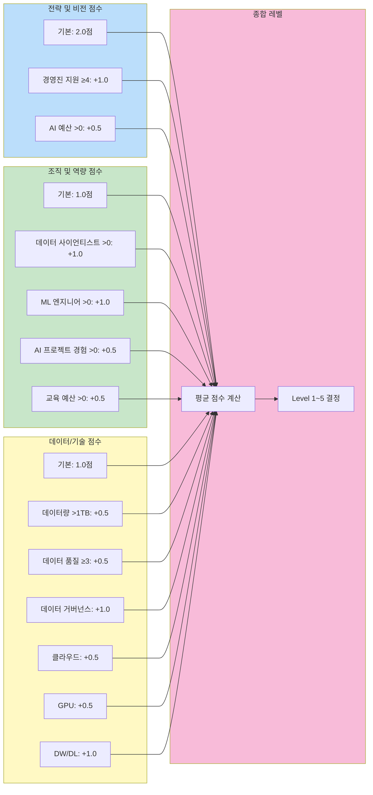

---

## 6. 시나리오 분석 워크플로우

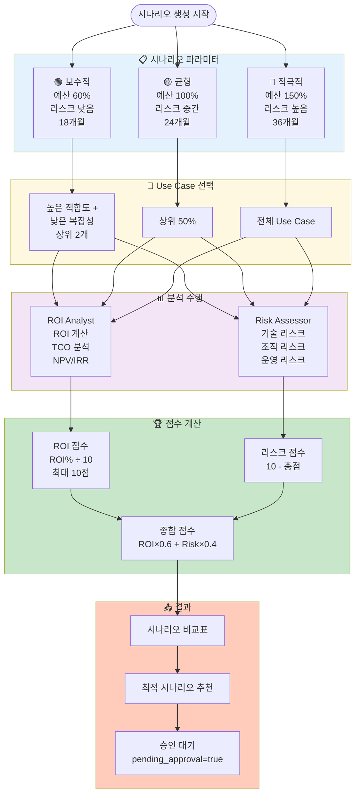

---

## 7. 인간-AI 협업 워크플로우

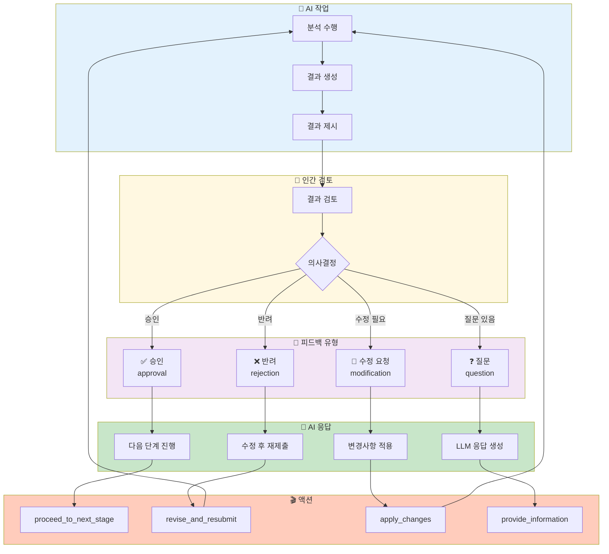

### 시나리오 승인 프로세스

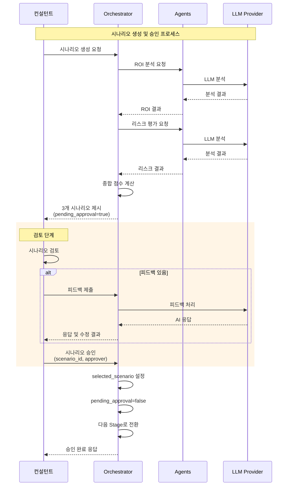

---

## 8. 보고서 생성 플로우

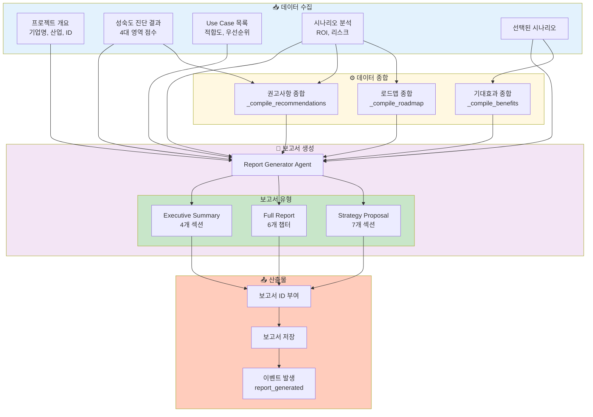

### Executive Summary 구조

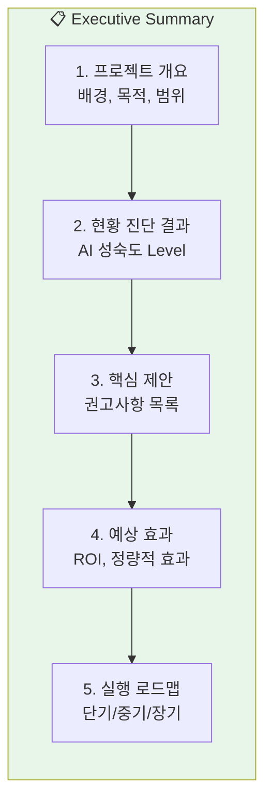

### Full Report 구조

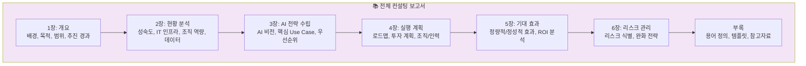

---

## 9. API 요청 흐름

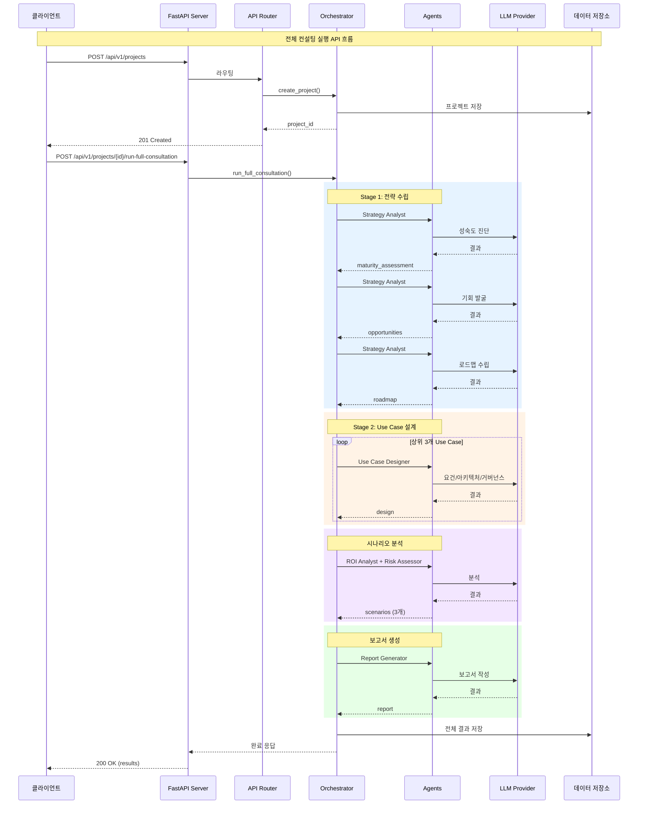

---

## 부록: 상태 전이 다이어그램

### 프로젝트 Stage 전이

```mermaid
stateDiagram-v2
    [*] --> STRATEGY: 프로젝트 생성
    
    STRATEGY --> DESIGN: 전략 수립 완료
    DESIGN --> BUILD: Use Case 설계 완료
    BUILD --> SCALE: 솔루션 구축 완료
    SCALE --> OPERATE: 파일럿/확산 완료
    OPERATE --> [*]: 프로젝트 종료
    
    note right of STRATEGY: Stage 1<br/>AI 비전 및 전략 수립
    note right of DESIGN: Stage 2<br/>Use Case 및 설계 정의
    note right of BUILD: Stage 3<br/>플랫폼 및 솔루션 구축
    note right of SCALE: Stage 4<br/>파일럿 및 확산
    note right of OPERATE: Stage 5<br/>운영/모니터링/개선
```

### 에이전트 상태 전이

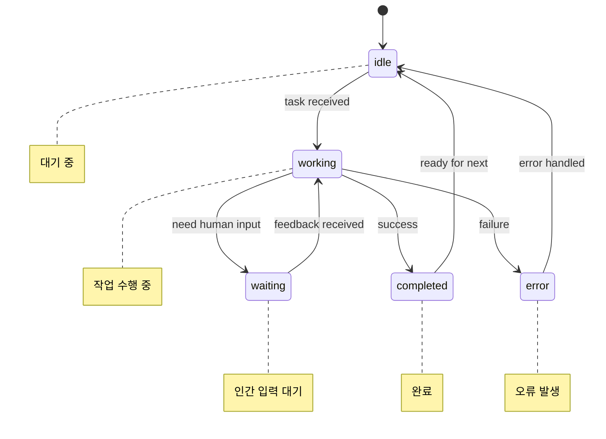

---

## 문서 이력

| 버전 | 날짜 | 작성자 | 변경 내용 |
|------|------|--------|----------|
| 1.0 | 2025-12-11 | Brian Lee | 초기 문서 작성 |
| 1.1 | 2025-12-16 | Brian Lee | 문서 업데이트 및 편집자 정보 갱신 |

---

**Copyright © 2025 WDLAB AI/ML/AX Group. All rights reserved.**

